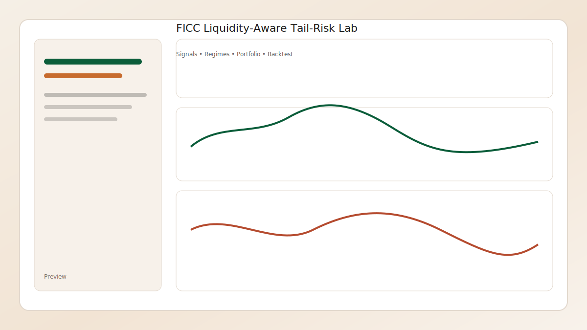

# FICC Liquidity-Aware Tail-Risk Lab (R + Shiny)

[](https://www.r-project.org/)
[](https://shiny.posit.co/)
[](LICENSE)
[](https://github.com/Saahil-Dey-Vishal/ficc-tailrisk-shiny-lab/commits/main)
[](#quick-start)
[](#docker)

A weekly, Friday-close portfolio research lab for FICC ETF sleeves using Yahoo Finance data. It blends
liquidity estimates, tail-risk structure, discrete trade sizing, and portfolio optimization into a
single Shiny dashboard, then paper-trades **in simulation** (no broker connection).



## What it does
- Weekly rebalancing on Friday close
- Liquidity-aware signal scoring (bid-ask spread estimates)
- Tail-risk features (rolling skew/kurtosis + HOFA factor plot if available)
- Regime filters (rates and credit risk-on/off)
- Discrete trade/size modeling (echoice2 if available)
- Portfolio optimization (portfolio.optimization if available)
- Max drawdown guardrail (8% default) that shifts to BIL when breached

## ETF universe
The default universe targets liquid FICC sleeves plus FX and commodities proxies:
`AGG, BIL, SHY, IEF, TLT, TIP, MBB, LQD, HYG, EMB, MUB, FLOT, USDU, GSG`

Edit `config/universe.csv` to customize.

## Quick start
1. Install packages

```r
install.packages(c(
  "shiny", "bslib", "DT", "ggplot2", "scales",
  "quantmod", "xts", "zoo", "moments",
  "dplyr", "tidyr"
))

# Optional (used when available)
install.packages(c(
  "bidask", "hofa", "echoice2", "portfolio.optimization", "rsims"
))
```

2. Run the app

```r
shiny::runApp(".")
```

3. Run the pipeline headless (optional)

```r
Rscript scripts/run_pipeline.R 2019-01-01 2025-12-31
```

## Docker
1. Build the image

```bash
docker build -t ficc-tailrisk-shiny-lab .
```

2. Run the container

```bash
docker run --rm -p 3838:3838 ficc-tailrisk-shiny-lab
```

3. Open

```
http://localhost:3838
```

## Notes
- Data is pulled from Yahoo Finance via `quantmod` and resampled to weekly bars.
- If `bidask`, `hofa`/`HOFA`, `echoice2`, or `portfolio.optimization` are not installed, the system
  falls back to deterministic heuristics so the app still runs.
- Regime signals use weekly momentum on `TLT` (rates) and `HYG - LQD` (credit).
- The drawdown guardrail uses a **next-week risk-off switch** into `BIL` after a breach.

## Structure
- `app.R` Shiny UI
- `R/` data, features, portfolio, and backtest modules
- `config/universe.csv` ETF universe
- `scripts/run_pipeline.R` CLI entrypoint
- `data/` results cache (not tracked)

## Disclaimer
This is a research/education tool. It is not investment advice.
